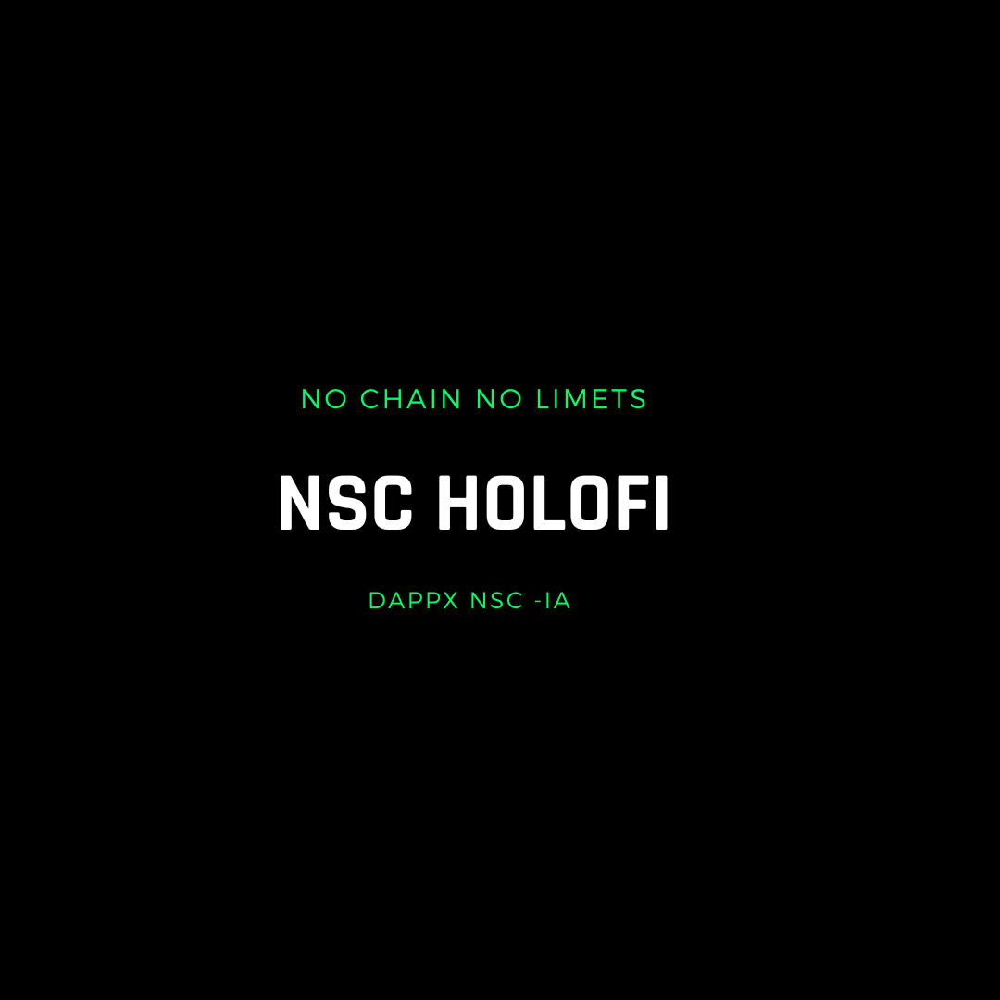

🌎 RubyX NSC IA Z 🌎

Description
NSC IA Z is an advanced HoloFi platform designed to facilitate decentralized applications (DApps) and digital asset management. It integrates a range of cutting-edge technologies to ensure secure and efficient tokenization, transactions, and smart contract operations.

Key Features
Customizable Digital Assets: Create and manage digital assets on the NSC IA Z HoloFi network.
Secure Transfers: Efficient and secure transfer and verification of digital assets.
Planetary Integration: Advanced functionalities with a focus on Earth and Space integration.
Quantum Computing: Capabilities for hybrid digital asset creation and quantum computing integration.
Enhanced by Horigami FX: Advanced tokenization mechanics, security protocols, scalability, and interoperability.
Prerequisites
Lua installed on your machine.
NSC IA Z client configured and synchronized with the HoloFi network.
Basic knowledge of Java, TypeScript, RubyX, JavaScript, Shell, SQL, and CMake for smart contract development.
Internet connection for interaction with the NSC IA Z HoloFi network.
Usage Instructions
Cloning the Repository:

sh
Copiar código
git clone https://github.com/your-username/nsc-ia-z-dapp.git
Installing Dependencies:

sh
Copiar código
cd nsc-ia-z-dapp
npm install
Configuring the NSC IA Z HoloFi Network:

Ensure your NSC IA Z client is operational and synced.
Set up environment variables in the .env file with your NSC IA Z HoloFi network details.
Deploying Smart Contracts:

Compile and deploy smart contracts on the NSC IA Z HoloFi network as required.
Update contract addresses in the configuration files (config.js, etc.) post-deployment.
Running the DApp:

sh
Copiar código
npm start
Interacting with NSC IA Z DApp:

Utilize provided REST API endpoints to manage digital assets and execute transactions.
Digital assets are represented as customizable tokens on the NSC IA Z HoloFi network.
Planetary Integration
NSC IA Z integrates advanced functionalities with a focus on Earth and Space, enhancing security, transparency, and computational efficiency for DApps.

Quantum Computing with Hybrid Asset Creation
NSC IA Z integrates innovative solutions for hybrid digital asset creation and quantum computing, pushing the frontiers of decentralized applications and digital asset management.

New Configurations
Updated Environment Configuration: Ensure to include the latest environment variables related to HORIZON FX and Quantum capabilities in your .env file.
New Dependencies: Added support for quantum integration libraries and Horigami FX updates.
Lua Code Example
For Lua integration with NSC IA Z, you can use the following code snippet for investment management:

lua
Copiar código
-- Define o módulo HollowEngine
HollowEngine = {}
HollowEngine.__index = HollowEngine

-- Cria uma nova instância do HollowEngine
function HollowEngine.new(investment_contract_address, authentication_contract_address)
    local self = setmetatable({}, HollowEngine)
    self.investment_contract_address = investment_contract_address
    self.authentication_contract_address = authentication_contract_address
    self.plans = {}
    self.investments = {}
    return self
end

-- Adiciona um plano de investimento
function HollowEngine:add_plan(plan_name, initial_investment, monthly_return, annual_return, net_annual_return, slots)
    local plan = {
        plan_name = plan_name,
        initial_investment = initial_investment,
        monthly_return = monthly_return,
        annual_return = annual_return,
        net_annual_return = net_annual_return,
        slots = slots
    }
    self.plans[plan_name] = plan
    print("Plan added successfully!")
end

-- Realiza um investimento em um plano
function HollowEngine:invest(plan_name, amount, investor_address)
    local plan = self.plans[plan_name]
    if not plan then
        error("Investment plan not found: " .. plan_name)
    end
    local investment = {
        plan_name = plan_name,
        amount = amount,
        investor_address = investor_address
    }
    self.investments[investor_address] = investment
    print("Investment completed successfully!")
end

-- Autentica uma mensagem
function HollowEngine:authenticate_message(message_hash)
    -- Simula a lógica de autenticação de mensagem
    print("Message authenticated successfully!")
end

-- Função principal para testes
local function main()
    -- Endereços de exemplo para contratos simulados
    local investment_contract_address = "0x1111111111111111111111111111111111111111"
    local authentication_contract_address = "0x2222222222222222222222222222222222222222"

    -- Instanciar HollowEngine com endereços simulados
    local engine = HollowEngine.new(investment_contract_address, authentication_contract_address)

    -- Adicionar um plano de investimento
    print("\nStep 1: Adding an Investment Plan")
    engine:add_plan("economicPlan", 500, 5, 60, 300, 500)

    -- Simular o investimento em um plano
    print("\nStep 2: Investing in the economicPlan")
    engine:invest("economicPlan", 100, "0x3333333333333333333333333333333333333333")

    -- Autenticar uma mensagem
    print("\nStep 3: Authenticating a Message")
    local message_hash = "0xabcdef1234567890abcdef1234567890abcdef1234567890abcdef1234567890"
    engine:authenticate_message(message_hash)

    -- Fim dos testes
    print("\nKernel test steps completed.")
end

main()
Conclusion
NSC IA Z is at the cutting edge of HoloFi technology, providing a robust platform for decentralized applications and digital asset management. With advanced integrations like planetary functionalities and quantum computing capabilities, NSC IA Z is set to redefine the HoloFi landscape.

FOUNDER: LUCAS JANAURIO DO NASCIMENTO
 
Thank you for your attention!

